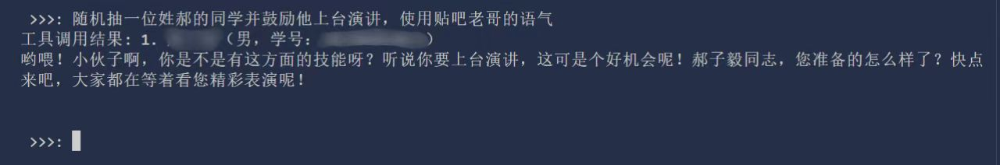

# 通过函数调用完成随机点名操作

# feature

* 从男生/女生里随机挑一个
* 从["李"，"张"，......] 姓同学里随机挑一个点名
* 从学号[xxxxxxxxxxxx,yyyyyyyyyyy]区间内挑一个 （toml文件中已经存在的学号）
* 根据名字字数来随机选择一个
* 以上方法的组合 例如从男生+姓[李，王，张]+3个字的同学里随机挑一个
* x连抽 （一次性返回x次随机点名结果）
* 支持ollama提供的本地大模型，以及在线模型 (openai响应格式)

## 使用自然语言提出要求

Ollama 模型：llama:8b --- (deepseek 暂不支持)

在线模型 ： openai格式

函数调用流程

`用户输入 -> AI提取参数并结构化输出 - > 代入函数运行 获取结果 - > 将结果保存在messages -> 发送给AI`

# 鸣谢**

使用的开源项目：

ollama -- 适合没有api时候的快速测试验证 -- 由于运行在本地，参数量较小，性能有限函数调用能力偏弱

openai -- 允许自定义第三方api key
